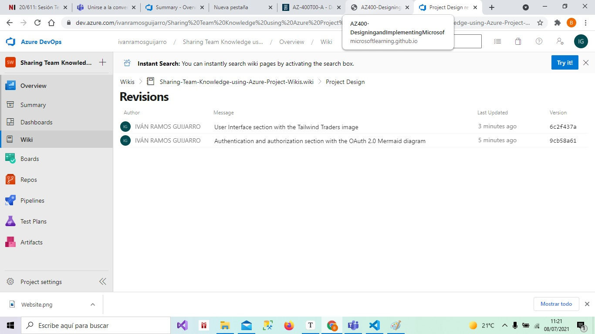

# Lab 03: Sharing Team Knowledge using Azure Project Wikis


 	




# GitHub Actions

TailwindTraders Website has three workflows on GitHub Actions to build and deploy the website upon these environments:

- Azure App Service ([regular_appservice.yaml](https://dev.azure.com/ivanramosguijarro/Sharing Team Knowledge using Azure Project Wikis/_wiki/wikis/Tailwind Traders (Documents)?wikiVersion=GBmain&pagePath=orkflows%2Fregular_appservice.yaml))
- Containerized Azure App Service ([container_appservice.yaml](https://dev.azure.com/ivanramosguijarro/Sharing Team Knowledge using Azure Project Wikis/_wiki/wikis/Tailwind Traders (Documents)?wikiVersion=GBmain&pagePath=orkflows%2Fcontainer_appservice.yaml))
- An existing AKS with that already has TailwindTraders Backend installed ([aks.yaml](https://dev.azure.com/ivanramosguijarro/Sharing Team Knowledge using Azure Project Wikis/_wiki/wikis/Tailwind Traders (Documents)?wikiVersion=GBmain&pagePath=orkflows%2Faks.yaml))

Also, there is a workflow ([pr_build_check.yaml](https://dev.azure.com/ivanramosguijarro/Sharing Team Knowledge using Azure Project Wikis/_wiki/wikis/Tailwind Traders (Documents)?wikiVersion=GBmain&pagePath=orkflows%2Fpr_build_check.yaml)) to make a build, in order to be used as a check in the Pull Requests against the master branch.

## Azure App Service

### Requirements

- A created Azure App Service

### Secrets

You must set the following secrets on your GitHub TailwindTraders Website repository:

- *WEBAPP_APPSERVICE_NAME* -> The App Service's name you want to deploy the website.
- *AZURE_CREDENTIALS* An object with the Azure credentials you want to use:

```
{
   "clientId":,
   "clientSecret":,
   "subscriptionId": ,
   "tenantId":
}
```

- *WEBAPP_APP_SETTINGS* -> It's an array containing the following information:

```
[
  {
    "name": "ApiUrlShoppingCart",
    "value": "http://the-backend/the-cart-shopping", // set the Api Url Shopping cart you want to point
    "slotSetting": true
  },
  {
    "name": "ApiUrl",
    "value": "http://the-backend/the-cart-shopping", // set the Webbff's Api Url you want to point
    "slotSetting": true
  }
]
```

## Containerized Azure App Service

### Requirements

- A created Azure App Service, for publishing Linux containers
- A DockerHub repository you can push images

### Secrets

You must set the following secrets on your GitHub TailwindTraders Website repository:

- *CONTAINER_APPSERVICE_NAME* -> The App Service's name you want to deploy the website.
- *AZURE_CREDENTIALS* An object with the Azure credentials you want to use:

```
{
   "clientId":,
   "clientSecret":,
   "subscriptionId": ,
   "tenantId":
}
```

- *DOCKERHUB_USERNAME*
- *DOCKERHUB_PASSWORD*
- *CONTAINER_APP_SETTINGS* -> It's an array containing the following information:

```
[
  {
    "name": "ApiUrlShoppingCart",
    "value": "http://the-backend/the-cart-shopping", // set the Api Url Shopping cart you want to point
    "slotSetting": true
  },
  {
    "name": "ApiUrl",
    "value": "http://the-backend/the-cart-shopping", // set the Webbff's Api Url you want to point
    "slotSetting": true
  },
  {
    "name": "DOCKER_REGISTRY_SERVER_USERNAME",
    "value": "", // DockerHub username
    "slotSetting": true
  },
  {
    "name": "DOCKER_REGISTRY_SERVER_PASSWORD",
    "value": "", // DockerHub password
    "slotSetting": true
  }
]
```

## AKS

### Requirements

- A DockerHub repository you can push images
- A created AKS with TailwindTraders Backend deployed
- SSL enabled in the AKS

### Secrets

You must set the following secrets on your GitHub TailwindTraders Website repository:

- *AKS_CLUSTER_NAME* -> The cluster's name
- *AKS_RESOURCEGROUP_NAME* -> The resource group's name where the AKS is located
- *AKS_HOST_NAME* -> Cluster's DNS zone name. You can retrieve it through the following command:

```
az aks show --resource-group myResourceGroup --name myAKSCluster --query addonProfiles.httpApplicationRouting.config.HTTPApplicationRoutingZoneName -o table
```

- *AKS_TLS_SECRET_NAME* -> AKS secret name having the TLS cert
- *AZURE_CREDENTIALS* An object with the Azure credentials you want to use:

```
{
   "clientId":,
   "clientSecret":,
   "subscriptionId": ,
   "tenantId":
}
```

- *DOCKERHUB_USERNAME*
- *DOCKERHUB_PASSWORD*

